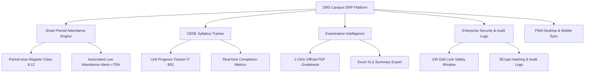

<div align="center">

  <!-- Animated Header Banner -->
  <a href="https://zmscampus.gt.tc/">
    
  </a>

  <br />

  

  # 🏫 ZMS Campus — Smart School ERP Platform

  **A Unique Educational Institution of Amba, Doimukh, Papumpare, Arunachal Pradesh**  
  *Affiliation Code: `ZMS-AMBA-2026` • Run by Zion Mission Society, Nirjuli*

  <br />

  <!-- Animated Tech Badges -->
  <p align="center">
    <a href="https://zmscampus.gt.tc/">
      
    </a>
    <a href="https://www.zionmissionschool.org/">
      
    </a>
    <a href="https://parthbhuyan.github.io/">
      
    </a>
  </p>

  <p align="center">
    
    
    
    
    
  </p>

</div>

---

## 🌟 Overview

**ZMS Campus** is an enterprise-grade Progressive Web Application (PWA) built specifically for **Zion Mission School, Amba**. Designed with custom PHP 8.3 MVC architecture and a clean Apple-level Glassmorphism light design system, it empowers faculty, administrators, and students with real-time academic workflows.

> [!IMPORTANT]
> **Production Live ERP Portal**: [https://zmscampus.gt.tc/](https://zmscampus.gt.tc/)  
> **Official Zion Mission School Website**: [https://www.zionmissionschool.org/](https://www.zionmissionschool.org/)

---

## ✨ Key Features & Capabilities



### 📋 Detailed Feature Highlights:

- 📊 **Period-Wise Attendance Engine**: Records class-by-class attendance for senior secondary students, tracking SID and flagging low attendance risks (<75% CBSE threshold).
- 📚 **CBSE Curriculum Progress Tracker**: Monitors unit-by-unit syllabus completion for IT (Code 802), Science, Humanities, and Commerce streams.
- 📄 **1-Click Export Automation**: Generates official CBSE printable PDF gradebooks (via `Dompdf`) and Excel spreadsheet registers (via `PhpSpreadsheet`).
- 🛡️ **Enterprise Security & Audit Trails**: Every record creation, update, and deletion is recorded in real-time with IP tracking and a strict 24-hour edit lock window.
- 📱 **Progressive Web App (PWA)**: Desktop and mobile installable app with offline caching via `sw.js` and custom launcher icons.

---

## 🎨 Glassmorphism Light Design System

The platform features a custom-engineered **Glassmorphism Light Theme**:

```
Background Palette : Warm Rose (#FFF5F2) ➔ Sky Indigo (#F4F7FF) ➔ Silk White (#FFFFFF)
Accent Palette     : Brand Red (#EE4826) • Warm Amber (#F59E0B) • Emerald (#10B981)
Glass Surface      : rgba(255, 255, 255, 0.82) with 24px backdrop-filter blur
Typography         : Google Font 'Plus Jakarta Sans' (Weights: 400, 600, 700, 800)
```

---

## 📁 Project Architecture & Folder Structure

```
zms-campus/
├── 📁 app/                     # Custom PHP 8.3 MVC Backend Architecture
│   ├── 📁 Controllers/         # AuthController, AttendanceController, SyllabusController, AuditController
│   ├── 📁 Models/              # Student, Attendance, Syllabus, AuditLog, AcademicCalendar
│   └── 📁 Views/               # Blade-style PHP Views with Glassmorphic Component UI
├── 📁 assets/                  # Public Web Assets
│   ├── 📁 icons/               # PWA App Icons (72x72 to 512x512)
│   ├── 📁 images/              # High-Res Campus Images (campus_building, computer_lab, etc.)
│   └── 📁 uploads/             # Profile Avatars & Official Documents
├── 📁 config/                  # Environment & PDO Database Singleton Configuration
├── 📁 static/                  # Glassmorphism Landing Page (index.html, style.css, script.js)
├── 📄 .env                    # Production Database Credentials & App Secrets
├── 📄 .htaccess                # Apache URL Rewriting & Physical File Exclusions
├── 📄 index.php                # Front Controller Entry Point
├── 📄 manifest.json            # PWA Manifest Specification
├── 📄 sw.js                    # Service Worker Offline Caching Script
└── 📄 zms_campus.sql           # Database Schema Dump & Initial Seed Data
```

---

## ⚡ Quick Start & Installation

### Prerequisites
- PHP 8.3 or higher with `pdo_mysql`, `gd`, and `mbstring` extensions enabled.
- MySQL 8.0 / MariaDB 10.4 or higher.
- Apache web server with `mod_rewrite` enabled.

### Step 1: Clone Repository
```bash
git clone https://github.com/parthbhuyan/zms-campus.git
cd zms-campus
```

### Step 2: Environment Setup
Create a `.env` file in the root directory:
```ini
APP_NAME="ZMS Campus"
APP_ENV=production
APP_DEBUG=false
APP_URL=https://zmscampus.gt.tc

DB_HOST=sql113.infinityfree.com
DB_PORT=3306
DB_DATABASE=if0_42616947_zms_campus
DB_USERNAME=if0_42616947
DB_PASSWORD=2026ZmsAmba
```

### Step 3: Database Import
Import `zms_campus.sql` into your MySQL server:
```bash
mysql -u if0_42616947 -p if0_42616947_zms_campus < zms_campus.sql
```

---

## 🔒 Security & Data Integrity

> [!TIP]
> **Audit Lock Window**: Records edited after 24 hours require administrative privilege override, preventing unauthorized post-dated grade or attendance tampering.

- 🔑 **BCrypt Hashing**: Passwords stored using `PASSWORD_BCRYPT` with cost factor 12.
- 🛡️ **PDO Prepared Statements**: 100% protection against SQL injection attacks.
- 🔐 **Session Security**: HttpOnly and SameSite cookie policies active.

---

## 👨‍💻 Lead Architect & Developer Credit

<div align="center">

  <a href="https://parthbhuyan.github.io/">
    
  </a>

  ### **Partha Bhuyan**
  *System Architect & Full-Stack Engineer*  
  🌐 **Portfolio**: [https://parthbhuyan.github.io/](https://parthbhuyan.github.io/)

</div>

---

<div align="center">
  <sub>© 2026 <strong>Zion Mission School, Amba</strong>. All Rights Reserved. CBSE Code: <code>ZMS-AMBA-2026</code>.</sub>
</div>
